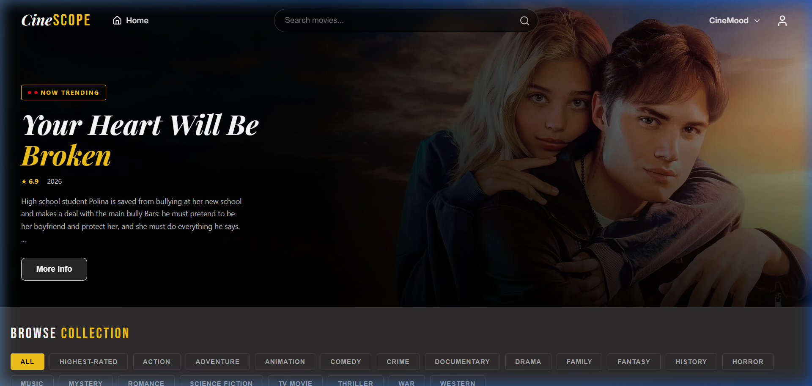
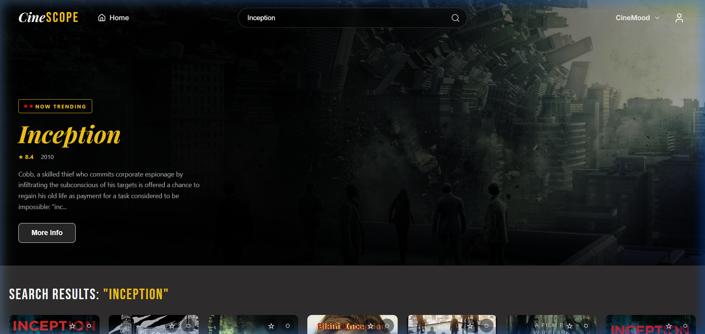
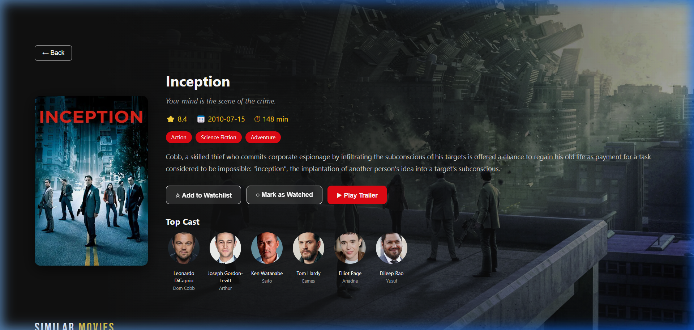
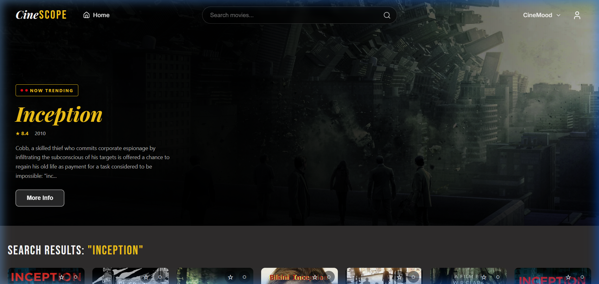
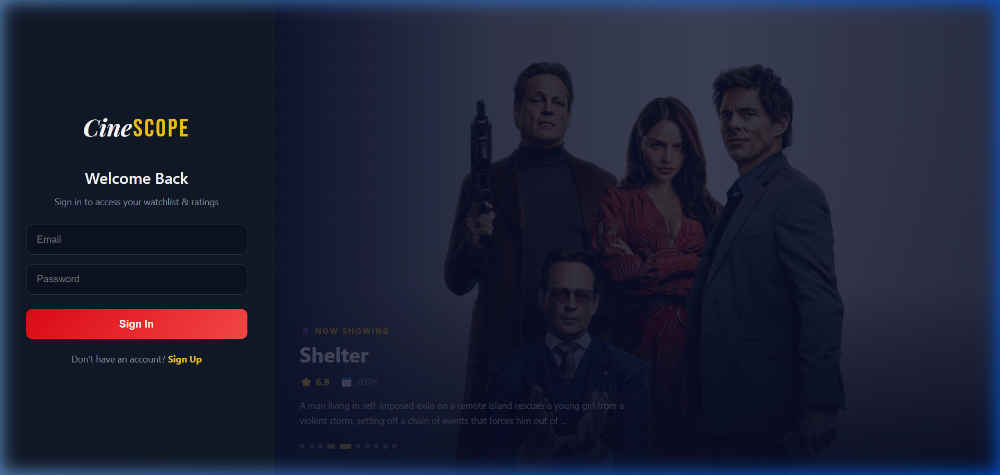

# 🎬 CineScope — Movie Catalog App

A sleek, full-stack movie discovery platform built with **React** and **Node.js**. Browse trending films, explore by genre or mood, build your personal watchlist, rate movies, and dive into detailed movie pages — all powered by the **TMDB API**.


---

## ✨ Features

### 🎥 Movie Discovery
- **Popular & Trending** — Browse the latest trending movies on the home page
- **Search** — Instant search with real-time results
- **Genre Filtering** — Filter movies by genre (Action, Comedy, Horror, etc.)
- **CineMood** — Discover movies by mood (Feel-Good, Thrilling, Mind-Bending, etc.)
- **Advanced Filters** — Sort by rating, release year, language, runtime, and more

### 🎬 Movie Details
- Detailed movie pages with cast, ratings, runtime, and overview
- User reviews from TMDB
- Related movie recommendations

### 👤 User Accounts
- **Sign Up / Sign In** — JWT-based authentication
- **Watchlist** — Save movies to watch later
- **Watched List** — Mark movies as watched with personal ratings

### 🎨 UI/UX
- Cinematic dark theme with golden accents
- Hero section with featured movie backdrop
- Skeleton loading animations
- Responsive design for all screen sizes
- Smooth hover effects and micro-animations

---

## 🛠️ Tech Stack

### Frontend
| Technology | Purpose |
|---|---|
| **React 19** | UI library |
| **Vite 7** | Build tool & dev server |
| **React Router 7** | Client-side routing |
| **Axios** | HTTP requests |
| **Lucide React** | Icon library |
| **Vanilla CSS** | Custom styling |

### Backend
| Technology | Purpose |
|---|---|
| **Node.js** | Runtime |
| **Express** | Web framework |
| **MongoDB + Mongoose** | Database & ODM |
| **JWT** | Authentication |
| **bcryptjs** | Password hashing |
| **express-validator** | Input validation |

### External API
- [TMDB (The Movie Database)](https://www.themoviedb.org/) — Movie data, images, and reviews

---

## 📁 Project Structure

```
movie-catalog/
├── frontend/                # React frontend (Vite)
│   └── src/
│       ├── components/      # Reusable UI components
│       │   ├── Navbar.jsx         # Navigation bar with search & mood selector
│       │   ├── MovieCard.jsx      # Movie card with hover effects
│       │   ├── HeroSection.jsx    # Featured movie banner
│       │   ├── GenreFilter.jsx    # Genre filter bar
│       │   └── FilterControls.jsx # Advanced sorting/filtering
│       ├── pages/
│       │   ├── MovieDetail.jsx    # Individual movie page
│       │   └── AuthPage.jsx       # Login / Register page
│       ├── context/
│       │   └── AuthContext.jsx    # Auth & watchlist state management
│       ├── api.js                 # TMDB API calls
│       ├── authApi.js             # Auth API calls
│       ├── App.jsx                # Main app with routing
│       └── App.css                # Global styles
│
├── backend/                 # Express backend
│   ├── models/
│   │   ├── User.js          # User schema
│   │   ├── Watchlist.js     # Watchlist schema
│   │   └── Watched.js       # Watched movies schema
│   ├── routes/
│   │   ├── auth.js          # Auth endpoints (register/login)
│   │   ├── tmdb.js          # TMDB proxy endpoints
│   │   ├── watchlist.js     # Watchlist CRUD
│   │   └── watched.js       # Watched list CRUD
│   ├── middleware/           # Auth middleware
│   └── index.js             # Server entry point
│
└── .gitignore
```

---

## 🚀 Getting Started

### Prerequisites
- **Node.js** (v18 or higher)
- **MongoDB** (local or [MongoDB Atlas](https://www.mongodb.com/atlas))
- **TMDB API Key** — Get one free at [themoviedb.org](https://www.themoviedb.org/settings/api)

### 1. Clone the Repository

```bash
git clone https://github.com/its-sriyash/movie-catalog.git
cd movie-catalog
```

### 2. Set Up the Backend

```bash
cd backend
npm install
```

Create a `.env` file in the `backend/` folder:

```env
PORT=5000
MONGO_URI=your_mongodb_connection_string
JWT_SECRET=your_jwt_secret_key
TMDB_API_KEY=your_tmdb_api_key
```

Start the backend:

```bash
npm run dev
```

### 3. Set Up the Frontend

```bash
cd frontend
npm install
npm run dev
```

The app will be running at **http://localhost:5173** 🎉

---

## 📸 Screenshots

### 🏠 Home Page
> Hero section with trending movies, genre filters, and the cinematic dark theme.



---

### 🔍 Search
> Real-time search results — here showing results for "Inception".



---

### 🎬 Movie Details
> In-depth movie page with cast, genres, ratings, trailer link, and watchlist actions.



---

### 😎 CineMood
> Discover movies by mood — Neo-Noir, Psycho-Thriller, Feel-Good, Anime, and more.



---

### 🔐 Authentication
> Clean sign-in page with a featured movie carousel.



---

## 🤝 Contributing

1. Fork the repository
2. Create a feature branch (`git checkout -b feature/amazing-feature`)
3. Commit your changes (`git commit -m 'Add amazing feature'`)
4. Push to the branch (`git push origin feature/amazing-feature`)
5. Open a Pull Request

---

## 📝 License

This project is licensed under the **ISC License**.

---

## 🙏 Acknowledgments

- [TMDB](https://www.themoviedb.org/) for the movie database API
- [Lucide](https://lucide.dev/) for beautiful icons
- [Google Fonts](https://fonts.google.com/) for typography

---

<p align="center">
  Built with ❤️ by <a href="https://github.com/its-sriyash">its-sriyash</a>
</p>
